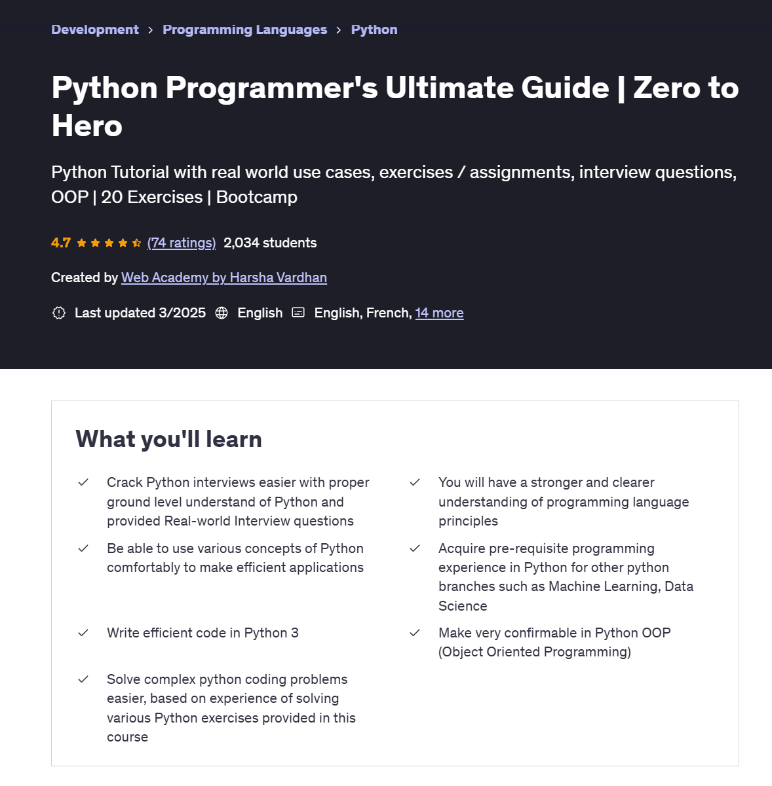

# Python_Programmers_Ultimate_Guide
## Content
* Code practice associated with the Udemy course **"Python Programmer's Ultimate Guide | Zero to Hero"** authored by Harsha Vardhan
* course url: https://www.udemy.com/course/python-programmers-ultimate-guide-for-beginners-project/

## Rating
As a mid-level Python developer, I took **"Python Programmer's Ultimate Guide"** to brush up on the basics. It covers fundamentals thoroughly, with clear explanations of syntax, data types, and OOP, often illustrated with real-world examples, reinforcing core concepts I hadn't practiced recently.

The structured lessons and exercises effectively refreshed my knowledge, and I even picked up a few new insights and best practices. Though most content was familiar territory as expected, I appreciated the concise recap of key topics. Overall, it's a helpful refresher for someone with moderate Python experience, even if it occasionally feels a bit basic.

## Course details
 

 ## Commits by
* George Calin
* george.calin [at] gmail.com
* Connect me on LinkedIn: https://www.linkedin.com/in/cgeorge1978/

 
